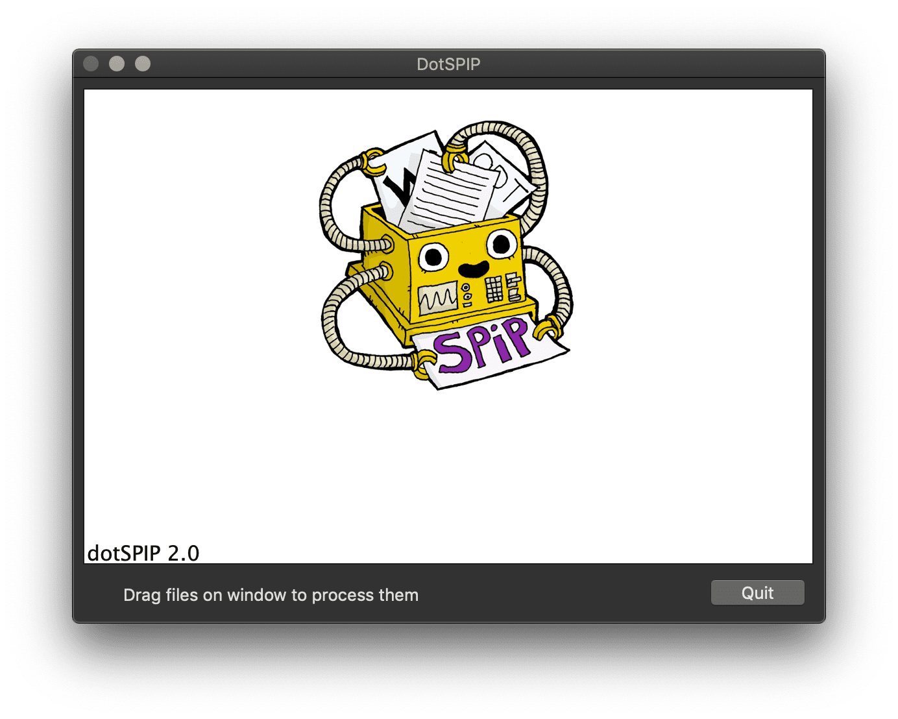

Une application drag-drop qui convertit des textes de divers formats vers les {{raccourcis SPIP}}.

## Téléchargement

Les différentes versions sont téléchargeables dans l'onglet [releases](https://github.com/Fil/DotSPIP/releases).

Note: l'application n'est [pas signée](https://sveinbjorn.org/files/manpages/PlatypusDocumentation.html), ce qui provoque une alerte de sécurité de Gatekeeper lors de son premier lancement -- à faire avec le menu contextule du Finder (ctrl-click puis “Ouvrir”).

## Making-of

Le code principal est un script en PHP, et l'emballage pour macOS est assuré par [Platypus](https://sveinbjorn.org/platypus). 

Les réglages sont les suivants:

L'application DotSPIP est placée sous licence GNU/GPL. Le logo est une création de baroug.

## Remerciements

- Sveinbjorn Thordarson pour Platypus
- Baroug pour l’icône
- les vieux de la vieille de SPIP pour la fonction sale()
- Vincent pour les guillemets
