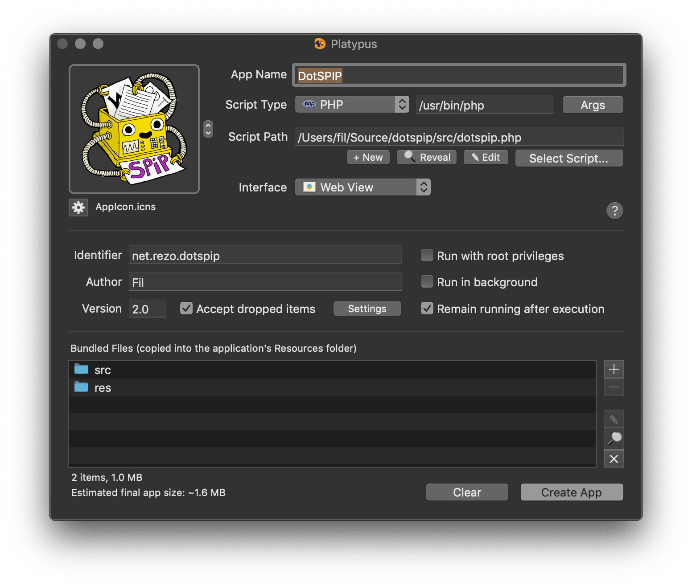

Une application drag-drop qui convertit des textes de divers formats vers les raccourcis SPIP.

Le code principal est un script en PHP, et l'emballage pour macOS est assuré par [Platypus](https://sveinbjorn.org/platypus). 

Les réglages sont les suivants:

L'application DotSPIP est placée sous licence GNU/GPL. Le logo est une création de baroug.